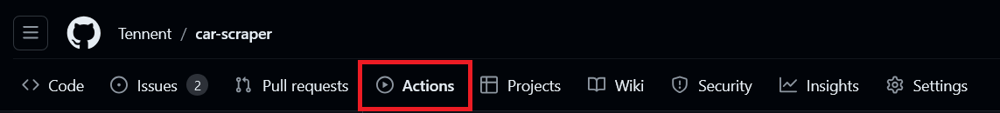

<!-- PROJECT LOGO -->
 

  

<h3 align="center">Car Scraper Project</h3>

<!-- TABLE OF CONTENTS -->

  
Table of Contents

  <ol>
    <li>
      <a href="#about-the-project">About The Project</a>
      <ul>
        <li><a href="#built-with">Built With</a></li>
      </ul>
    </li>
    <li>
      <a href="#getting-started">Getting Started</a>
      <ul>
        <li><a href="#prerequisites">Prerequisites</a></li>
        <li><a href="#installation">Installation</a></li>
      </ul>
    </li>
    <li><a href="#usage">Usage</a></li>
    <li><a href="#contact">Contact</a></li>
  </ol>

<!-- ABOUT THE PROJECT -->
## About The Project

This web scraper application is designed to collect model and price data and store it in a database. The project is a demonstration of my skills in DevOps and infrastructure management, with a focus on automation and reliability.

Key Features:

  - **Data Collection:** The scraper extracts model and pricing information from the target website.
  - **Database Integration:** Collected data is stored in a database, organized for easy access.
  - **Automation:** The entire process is automated, from data extraction to database storage, reducing manual intervention and ensuring continuous operation.
  - **Infrastructure as Code:** The project leverages infrastructure as code (IaC) principles to manage deployment, ensuring consistent and reproducible environments.
  - **DevOps Best Practices:** The project follows DevOps best practices, including CI/CD pipelines, automated testing, and containerization, ensuring smooth development and deployment processes.

This project serves as a practical showcase of my ability to design, implement, and manage infrastructure systems, highlighting my proficiency in both software development and DevOps methodologies.

(<a href="#readme-top">back to top</a>)

### Built With

* [![Shell][Shell]][Shell-url]
* [![Python][Python]][Python-url]
* [![Docker][Docker]][Docker-url]
* [![Terraform][Terraform]][Terraform-url]
* [![GitHubActions][GitHubActions]][GitHubActions-url]
* [![AWS][AWS]][AWS-url]

(<a href="#readme-top">back to top</a>)

<!-- GETTING STARTED -->
## Getting Started

To get your on deployment up and running follow these simple steps.

### Prerequisites

* AWS Account - [Register Here](https://signin.aws.amazon.com/signup?request_type=register)
* AWS Access Key - [Guide](https://docs.aws.amazon.com/IAM/latest/UserGuide/id_credentials_access-keys.html)
* Docker Hub Account - [Register Here](https://app.docker.com/signup)
* Docker Personal Access Token - [Guide](https://docs.docker.com/security/for-developers/access-tokens/)
  

### Installation

0. Set up the following repository secrets for you workflow

  * AWS_ACCOUNT_ID - [Find it here](https://repost.aws/questions/QUz8hTa39ZRAKk4yodHkDL9w/where-can-i-find-my-aws-account-id)
  * AWS_ACCESS_KEY_ID - Generated in the 'Prerequisites' section
  * AWS_SECRET_ACCESS_KEY - Generated in the 'Prerequisites' section
  * AWS_REGION - The region you prefer to use for AWS deployment (e.g.: eu-north-1)
  * DOCKERHUB_USERNAME - The Docker Hub username you signed up with
  * DOCKERHUB_TOKEN - Generated in the 'Prerequisites' section
  * SCRAPE_URL - The URL to scrape (in this case its set up tp work with https://auto.suzuki.hu/modellek only)

1. Select the Settings tab in the GitHub repo

   

2. Select Actions within Secrets and variables from the Security section on the left

   

3. Click the New repository secret button

   

4. Fill in the secret name and value, then click Add secret

   

(<a href="#readme-top">back to top</a>)

<!-- USAGE EXAMPLES -->
## Usage

Follow thse steps to run the workflow and view the finsihed output.

1. Select the Actions tab in the GitHub repo

   

2. Select the CI workflow from the lost on the left

   

3. Click the dropdown menu for Run workflow and select the branch to run the workflow on (it should always be main)

   

4. Wait for the CI and CD workflows to finish

   

5. Search for DynamoDB in the AWS Management Console

   

6. View the database content

   

(<a href="#readme-top">back to top</a>)

<!-- CONTACT -->
## Contact

Zalán Márton - [LinkedIn](https://www.linkedin.com/in/zalan-marton/) - zalan.marton@gmail.com

Project Link: [https://github.com/Tennent/car-scraper](https://github.com/Tennent/car-scraper)

(<a href="#readme-top">back to top</a>)

<!-- MARKDOWN LINKS & IMAGES -->
<!-- https://www.markdownguide.org/basic-syntax/#reference-style-links -->
[Shell]: https://img.shields.io/badge/shell_script-%23121011.svg?style=for-the-badge&logo=gnu-bash&logoColor=white
[Shell-url]: https://www.gnu.org/software/bash/
[Python]: https://img.shields.io/badge/python-3670A0?style=for-the-badge&logo=python&logoColor=ffdd54
[Python-url]: https://www.python.org/
[Docker]: https://img.shields.io/badge/docker-%230db7ed.svg?style=for-the-badge&logo=docker&logoColor=white
[Docker-url]: https://www.docker.com/
[Terraform]: https://img.shields.io/badge/terraform-%235835CC.svg?style=for-the-badge&logo=terraform&logoColor=white
[Terraform-url]: https://www.terraform.io/
[AWS]: https://img.shields.io/badge/AWS-%23FF9900.svg?style=for-the-badge&logo=amazon-aws&logoColor=white
[AWS-url]: https://aws.amazon.com/
[GitHubActions]: https://img.shields.io/badge/github%20actions-%232671E5.svg?style=for-the-badge&logo=githubactions&logoColor=white
[GitHubActions-url]: https://github.com/features/actions
